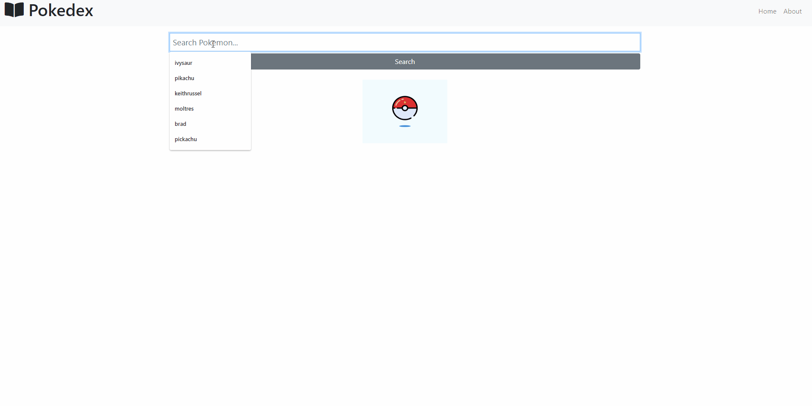

# p0kedexplorer

p0kedexplorer use to search all pokemons you want.
Check the [sample link](https://p0kedexplorer.netlify.app/)



## Installation

If you want to run to your local make sure you have nodejs on your desktop/laptop.

```
npm start #run client side
```

## Features

- Search Pokemon
- Handling PokeAPI

## Tech Used

- Reactjs
- Node
- React Context API Hooks
